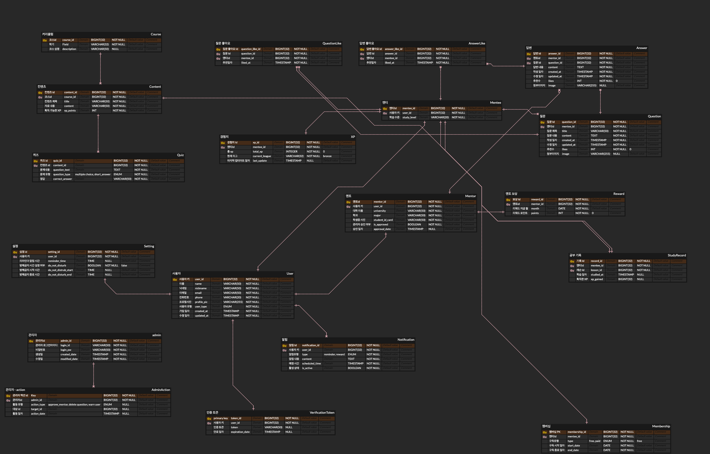

# MathMate - 수학을 친구처럼! 쉽고 재미있게 수학 개념을 익힐 수 있는 서비스

# 🩵MathMate🩵 - 프로젝트 개요

> **MathMate : 당신의 수학 친구가 되어드릴게요.**

> **기획기간: 2024.07.15~2024.07.17**

 
> **따분하고 어려운 수학 개념서에 의해 학습 부진 상태가 된 중고등학생들의 수학 학력 수준을 높여주고, 저렴한 구독료로 Q&A 서비스를 이용하여 수학 공부에 어려움을 겪는 학생들에게 도움을 줄 수 있는 서비스**

## 🗓️ 기획안

> 요구사항 정의서 : https://docs.google.com/spreadsheets/d/1SwFm62ZFwaKZ_Ii6iGEoF-KPWIPlPxRlNmaQUcv1MYc/edit?usp=sharing >

 

> 기능 명세서 : https://sincere-nova-ec6.notion.site/cd31748f48af4b04b5fca1513349a272?pvs=4 >

 

> 프로젝트 계획서 : https://sincere-nova-ec6.notion.site/80697b45493446acb5723012b60797c7?pvs=4 >

 

> 아키텍쳐 설계 :

 

> 데이터 모델링(ERD) :

 

> 플로우 차트 :

 

> **UI/UX 디자인(Figma)** : [https://www.figma.com/design/JMyzXiXA4zmF2i3AqxTrvO/MathMate?node-id=0-1&t=5i8bVUEYQqG4RP0X-1](https://www.figma.com/design/JMyzXiXA4zmF2i3AqxTrvO/MathMate?node-id=0-1&t=5i8bVUEYQqG4RP0X-1)

## 👥 일석삼조팀 소개

### 🌟 1~2일차

|                    김민주                    |                      양상원                      |               박수형               |
| :------------------------------------------: | :----------------------------------------------: | :--------------------------------: |
| [@Minju-Kimm](https://github.com/Minju-Kimm) | [@sangwonsheep](https://github.com/sangwonsheep) | [@Gyaak](https://github.com/Gyaak) |

## 🌟 3~4일차

|                    김민주                    |                                                  |                                    |
| :------------------------------------------: | :----------------------------------------------: | :--------------------------------: |
| [@Minju-Kimm](https://github.com/Minju-Kimm) | [@sangwonsheep](https://github.com/sangwonsheep) | [@Gyaak](https://github.com/Gyaak) |

## 🌟 프로젝트 소개

## 🌟 시작 가이드

---

## Stacks 🐈

### Environment 🐈🐈

  

### Development 🔨

 

 

### Communication 💬

  

---

## 화면 구성 📺

| 멘티 메인 페이지 | 리그 확인 페이지 |
| :--------------: | :--------------: |
|                  |                  |

| 커리큘럼 소개 페이지 | 개념 학습 페이지 |
| :------------------: | :--------------: |
|                      |                  |

| 멘토 메인 페이지 | Q&A 게시판 페이지 |
| :--------------: | :---------------: |
|                  |                   |

---

## 주요 기능 📦

### ⭐️왕기초 수학 개념 학습

### ⭐️SKY 누나, 오빠가 알려줄게! Q&A 게시판

### ⭐️티어가 무려 10개! 수학 공부를 더 재미있게 도와주는 리그 시스템

---

## 아키텍쳐

### 디렉토리 구조
