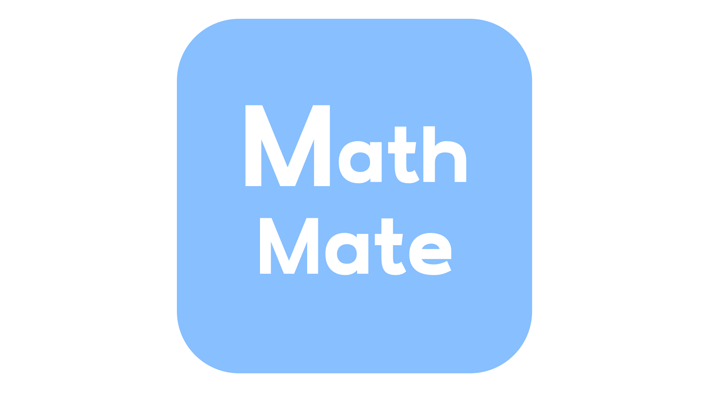

# MathMate - 수학을 친구처럼! 쉽고 재미있게 수학 개념을 익힐 수 있는 서비스



# 🩵MathMate🩵 - 프로젝트 개요

> **MathMate : 당신의 수학 친구가 되어드릴게요.**  
> **기획기간: 2024.07.15~2024.07.17**

## 기획안

> 요구사항 정의서 : https://docs.google.com/spreadsheets/d/1SwFm62ZFwaKZ_Ii6iGEoF-KPWIPlPxRlNmaQUcv1MYc/edit?usp=sharing
> 기능 명세서 : https://sincere-nova-ec6.notion.site/cd31748f48af4b04b5fca1513349a272?pvs=4
> 프로젝트 계획서 : https://sincere-nova-ec6.notion.site/80697b45493446acb5723012b60797c7?pvs=4
> 아키텍쳐 설계 :
> 데이터 모델링(ERD) :
> 플로우 차트 :
> **UI/UX 디자인(Figma)** : [https://www.figma.com/design/JMyzXiXA4zmF2i3AqxTrvO/MathMate?node-id=0-1&t=5i8bVUEYQqG4RP0X-1](https://www.figma.com/design/JMyzXiXA4zmF2i3AqxTrvO/MathMate?node-id=0-1&t=5i8bVUEYQqG4RP0X-1)

## 일석삼조팀 소개

### 1~2일차

|                    김민주                    |                      양상원                      |               박수형               |
| :------------------------------------------: | :----------------------------------------------: | :--------------------------------: |
| [@Minju-Kimm](https://github.com/Minju-Kimm) | [@sangwonsheep](https://github.com/sangwonsheep) | [@Gyaak](https://github.com/Gyaak) |

## 3~4일차

|                    김민주                    |                                                  |                                    |
| :------------------------------------------: | :----------------------------------------------: | :--------------------------------: |
| [@Minju-Kimm](https://github.com/Minju-Kimm) | [@sangwonsheep](https://github.com/sangwonsheep) | [@Gyaak](https://github.com/Gyaak) |

## 프로젝트 소개

## 시작 가이드

---

## Stacks 🐈

### Environment

[](https://camo.githubusercontent.com/e44113cc59b363e2f8bea43f073e0a61f2bcd1b2e79161c9cd03e6882cf5a4c2/68747470733a2f2f696d672e736869656c64732e696f2f62616467652f56697375616c25323053747564696f253230436f64652d3030374143433f7374796c653d666f722d7468652d6261646765266c6f676f3d56697375616c25323053747564696f253230436f6465266c6f676f436f6c6f723d7768697465) [](https://camo.githubusercontent.com/8d433710b84192cd318b602aadcf296eed6c443fea42c2f06fba2ce65a49a412/68747470733a2f2f696d672e736869656c64732e696f2f62616467652f4769742d4630353033323f7374796c653d666f722d7468652d6261646765266c6f676f3d476974266c6f676f436f6c6f723d7768697465) [](https://camo.githubusercontent.com/dc4e9f7ea9597ea5a27629a36afb9ef8697569c621ccb42369070012b4092ae1/68747470733a2f2f696d672e736869656c64732e696f2f62616467652f4769744875622d3138313731373f7374796c653d666f722d7468652d6261646765266c6f676f3d476974487562266c6f676f436f6c6f723d7768697465)

### Development

[](https://camo.githubusercontent.com/9f59bfda239bdfe25594781716d66250f906ece4d1f42e0a44cdfeb1b0de5491/68747470733a2f2f696d672e736869656c64732e696f2f62616467652f4a6176615363726970742d4637444631453f7374796c653d666f722d7468652d6261646765266c6f676f3d4a617661736372697074266c6f676f436f6c6f723d7768697465) [](https://camo.githubusercontent.com/6c3957842901e5baa389f3bb8758c8966683333b28493013062fcab5fab645e7/68747470733a2f2f696d672e736869656c64732e696f2f62616467652f52656163742d3230323332413f7374796c653d666f722d7468652d6261646765266c6f676f3d7265616374266c6f676f436f6c6f723d363144414642) [](https://camo.githubusercontent.com/57f9c54ade4444c2f8415dc1be4e0255797a10ae8c559c54ff31231c2afbd089/68747470733a2f2f696d672e736869656c64732e696f2f62616467652f5374726170692d3246324538423f7374796c653d666f722d7468652d6261646765266c6f676f3d537472617069266c6f676f436f6c6f723d7768697465) [](https://camo.githubusercontent.com/4f91e275b1a578b168a44a4a3480fcc2c096a89a02454293d1572266e94f4eed/68747470733a2f2f696d672e736869656c64732e696f2f62616467652f4e6578742e6a732d3030303030303f7374796c653d666f722d7468652d6261646765266c6f676f3d4e6578742e6a73266c6f676f436f6c6f723d7768697465) [](https://camo.githubusercontent.com/1ae02fee8b3b11db5f838efd27dbf9ba51b8b7359c6e7679fbf1fe22dbc57b13/68747470733a2f2f696d672e736869656c64732e696f2f62616467652f426f6f7473747261702d3739353242333f7374796c653d666f722d7468652d6261646765266c6f676f3d426f6f747374726170266c6f676f436f6c6f723d7768697465) [](https://camo.githubusercontent.com/3d819cd685111d9a709a03dcac750470ea0d172a87ca3cd544ab20bba6f33256/68747470733a2f2f696d672e736869656c64732e696f2f62616467652f4d6174657269616c25323055492d3030374646463f7374796c653d666f722d7468652d6261646765266c6f676f3d4d5549266c6f676f436f6c6f723d7768697465)

### Communication

[](https://camo.githubusercontent.com/8b20df4dce83849ed91f5dba04a42e793499dcd1064c094153dba4c1447390f3/68747470733a2f2f696d672e736869656c64732e696f2f62616467652f536c61636b2d3441313534423f7374796c653d666f722d7468652d6261646765266c6f676f3d536c61636b266c6f676f436f6c6f723d7768697465) [](https://camo.githubusercontent.com/c8820d740db3809eac6809b9da45c5178fdc41e97a6a433046a4a5c05b91ef93/68747470733a2f2f696d672e736869656c64732e696f2f62616467652f4e6f74696f6e2d3030303030303f7374796c653d666f722d7468652d6261646765266c6f676f3d4e6f74696f6e266c6f676f436f6c6f723d7768697465) [](https://camo.githubusercontent.com/6c2eea8252c0d09fbde43bff66e496f11edd2a8b7adbc4b3bc0d7567ca5d4c17/68747470733a2f2f696d672e736869656c64732e696f2f62616467652f476f6f676c654d6565742d3030383937423f7374796c653d666f722d7468652d6261646765266c6f676f3d476f6f676c652532304d656574266c6f676f436f6c6f723d7768697465)

---

## 화면 구성 📺

|     메인 페이지      |   소개 페이지    |
| :------------------: | :--------------: |
|                      |                  |
| 커리큘럼 소개 페이지 | 강의 영상 페이지 |
|                      |                  |

---

## 주요 기능 📦

### ⭐️

### ⭐️

### ⭐️

---

## 아키텍쳐

### 디렉토리 구조

```shell
├── README.md
├── package-lock.json
├── package.json
├── strapi-backend :
│   ├── README.md
│   ├── api : db model, api 관련 정보 폴더
│   │   ├── about
│   │   ├── course
│   │   └── lecture
│   ├── config : 서버, 데이터베이스 관련 정보 폴더
│   │   ├── database.js
│   │   ├── env : 배포 환경(NODE_ENV = production) 일 때 설정 정보 폴더
│   │   ├── functions : 프로젝트에서 실행되는 함수 관련 정보 폴더
│   │   └── server.js
│   ├── extensions
│   │   └── users-permissions : 권한 정보
│   ├── favicon.ico
│   ├── package-lock.json
│   ├── package.json
│   └── public
│       ├── robots.txt
│       └── uploads : 강의 별 사진
└── voluntain-app : 프론트엔드
    ├── README.md
    ├── components
    │   ├── CourseCard.js
    │   ├── Footer.js
    │   ├── LectureCards.js
    │   ├── MainBanner.js : 메인 페이지에 있는 남색 배너 컴포넌트, 커뮤니티 이름과 슬로건을 포함.
    │   ├── MainCard.js
    │   ├── MainCookieCard.js
    │   ├── NavigationBar.js : 네비게이션 바 컴포넌트, _app.js에서 공통으로 전체 페이지에 포함됨.
    │   ├── RecentLecture.js
    │   └── useWindowSize.js
    ├── config
    │   └── next.config.js
    ├── lib
    │   ├── context.js
    │   └── ga
    ├── next.config.js
    ├── package-lock.json
    ├── package.json
    ├── pages
    │   ├── _app.js
    │   ├── _document.js
    │   ├── about.js
    │   ├── course
    │   ├── index.js
    │   ├── lecture
    │   ├── newcourse
    │   ├── question.js
    │   └── setting.js
    ├── public
    │   ├── favicon.ico
    │   └── logo_about.png
    └── styles
        └── Home.module.css
```

# boot-up2-mathmate
