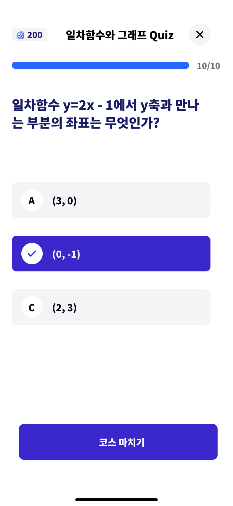
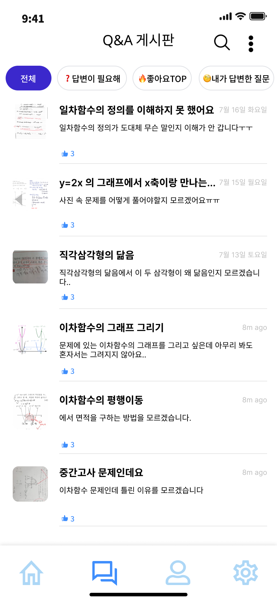

# MathMate - 수학을 친구처럼! 쉽고 재미있게 수학 개념을 익힐 수 있는 서비스

# 🩵MathMate🩵 - 프로젝트 개요

> **MathMate : 당신의 수학 친구가 되어드릴게요.**

> **기획기간: 2024.07.15~2024.07.17**

 

## 👥 일석삼조팀 소개

## 🌟 1~2일차

|                    김민주                    |                      양상원                      |               박수형               |
| :------------------------------------------: | :----------------------------------------------: | :--------------------------------: |
| [@Minju-Kimm](https://github.com/Minju-Kimm) | [@sangwonsheep](https://github.com/sangwonsheep) | [@Gyaak](https://github.com/Gyaak) |

## 🌟 3~4일차

|                    김민주                    |                이선우                |                이강민                |
| :------------------------------------------: | :----------------------------------: | :----------------------------------: |
| [@Minju-Kimm](https://github.com/Minju-Kimm) | [@I-migi](https://github.com/I-migi) | [@km2535](https://github.com/km2535) |

## 🌟 프로젝트 소개

MathMate는 수학이 어려운 중학교, 고등학교 학생들을 위해서 수학을 포기하지 않고 수학의 개념들을 가벼운 마음으로 접할 수 있도록 개념들을 익힐 수 있는 퀴즈와 모르는 문제가 있거나 앞으로의 계획이 고민될 때 사용할 수 있는 Q&A 서비스를 제공해주는 어플입니다

> **따분하고 어려운 수학 개념서에 의해 "학습 부진" 상태가 된 중고등학생들의 수학 학력 수준을 높여주고, 저렴한 구독료로 Q&A 서비스를 이용하여 수학 공부에 어려움을 겪는 학생들에게 도움을 줄 수 있는 서비스**

## 🗓️ 기획안

### 프로젝트 계획서

[프로젝트 계획서 - 노션](https://sincere-nova-ec6.notion.site/80697b45493446acb5723012b60797c7?pvs=4)

### 개요

- 프로젝트명 : MathMate
- 기간 : 2024년 7월 15일 ~ 2024년8월 31일(1.6개월 간)
- 참여인원 : 3명
  - 사용자, 마이페이지, 설정 : 김민주
  - 컨텐츠, 퀴즈 : 박수형
  - Q&A 게시판, 관리자 : 양상원
  - KBE2\_이선우
  - KBE2\_이강민
- 프로젝트 일정 및 내용
  - 기획 및 디자인 : 2024년 7월 18일 마감
  - 개발 : 2024년 8월 중 마감
- 기대효과
  - 딱딱하고 어려운 수학 개념서에 의해 학습 부진 상태가 된 중고등학생들의 수학 학력 수준을 높여줄 것으로 기대된다.
  - 보다 저렴한 구독료로 “MathMate” 서비스 내의 무제한 Q&A 서비스를 이용하여 수학 공부에 어려움을 겪는 학생들에게 도움이 될 것으로 기대된다.
  - 학생들이 개념서를 구매하지 않고도 무료로 어려운 수학 개념을 더욱 간단하고 쉽게 공부할 수 있게 되어, 수학에 대한 학생들의 흥미가 올라갈 것으로 기대된다.

 

### 요구사항 정의서

[요구사항 정의서 - 구글도큐먼트](https://docs.google.com/spreadsheets/d/1SwFm62ZFwaKZ_Ii6iGEoF-KPWIPlPxRlNmaQUcv1MYc/edit?usp=sharing)

 

### 기능명세서

[기능 명세서 - 노션](https://sincere-nova-ec6.notion.site/cd31748f48af4b04b5fca1513349a272?pvs=4)

 
### API 명세서

 
### 아키텍쳐 설계

#### 클라이언트

- 플러터
  - 크로스 플랫폼 개발 지원
  - 풍부한 디자인 도구 지원
  - 핫 로딩으로 개발 기간을 단축

#### 서버

- AWS EC2
  - 용량을 늘리거나 줄일 수 있다.
  - 사용한만큼 지불하므로 저렴하다.
  - 사용자가 인스턴스를 완전히 제어할 수 있다.
  - 보안 및 네트워크 구성, 스토리지 관리 효과적이다.
- 스프링 부트
  - 코드의 길이를 줄이는 어노테이션 제공으로 개발 시간 단축
  - 서버(아파치 톰캣)의 내장
  - 스프링 시큐리티, 필터 등 안정적이고 보안이 높은 애플리케이션 개발 가능
- 아파치 톰캣
  - 빠른 서버 배포 가능
  - 스프링 부트에 내장
- AWS RDS
  - 원하는 만큼 사이즈를 늘리거나 줄일 수 있는 탄력성
  - 다양한 DBMS 제공으로 높은 호환성
  - 쉬운 세팅
- MySQL
  - 가장 대중적인 DBMS
  - 스프링 부트와 높은 호환성
  - 손쉬운 사용
- Redis
  - **높은 트래픽**에서 빠른 DB 통신 제공
  - 다양한 프로그래밍 언어로 개발 가능
- R3
  - 높은 내구도를 자랑하며 정보를 안전하게 저장 가능
  - 저렴한 비용으로 사용 가능(ec2에 데이터를 저장하면 비용이 많이 나감)
  - 보안성이 뛰어남
  - 속도가 빠름
  - 나라별로 스토리지 버킷 지원이 가능
  - 버킷 버전 관리 가능

#### 외부 Open Api

- 유니서트
  - 국내 대학교 인증을 위한 API 제공
- 소셜로그인
  - 카카오, 네이버, 구글 등 이미 가입된 사용자의 **가용성**을 높임

 

> 데이터 모델링(ERD) :

 

> 플로우 차트 :

[플로우차트](https://www.figma.com/board/oH6JiSzoebES8RKL24kDVc/Untitled?node-id=0-1&t=KoI5wbtQwKCZmHU1-1)

 

> **UI/UX 디자인(Figma)** : [https://www.figma.com/design/JMyzXiXA4zmF2i3AqxTrvO/MathMate?node-id=0-1&t=5i8bVUEYQqG4RP0X-1](https://www.figma.com/design/JMyzXiXA4zmF2i3AqxTrvO/MathMate?node-id=0-1&t=5i8bVUEYQqG4RP0X-1)

---

## Stacks 🐈

### Environment 🐈🐈

### Development 🔨

### Communication 💬

---

## 화면 구성 📺

|          멘티 메인 페이지          |    리그 확인 페이지     |
| :--------------------------------: | :---------------------: |
|  |  |

|        멘티 커리큘럼 페이지        |        멘티 퀴즈 페이지         |
| :--------------------------------: | :-----------------------------: |
|  |  |

|        멘토 메인 페이지         |   Q&A 게시판 페이지   |
| :-----------------------------: | :-------------------: |
|  |  |

---

---
